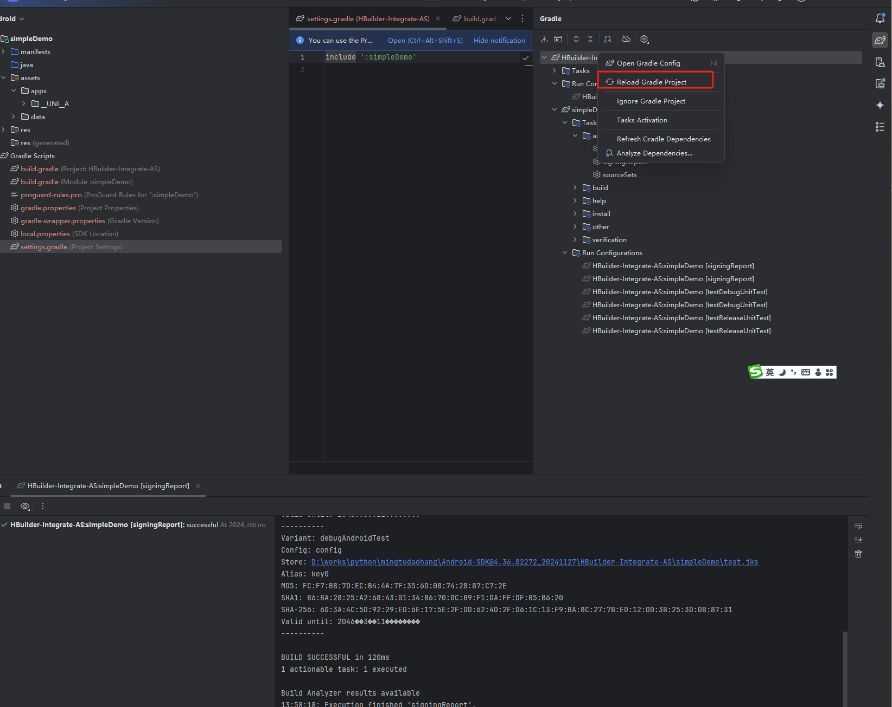

### 打包教程地址
https://nativesupport.dcloud.net.cn/AppDocs/


### 修改 [text](../../python/mingtudaohang/Android-SDK@4.36.82272_20241127/HBuilder-Integrate-AS/gradle/wrapper/gradle-wrapper.properties)
```
#Sun Dec 15 21:55:20 CST 2024
distributionBase=GRADLE_USER_HOME
distributionPath=wrapper/dists
zipStoreBase=GRADLE_USER_HOME
zipStorePath=wrapper/dists
distributionUrl=file:///D://software/gradle-8.10.2-all.zip
```
### 再改 [text](../../python/mingtudaohang/Android-SDK@4.36.82272_20241127/HBuilder-Integrate-AS/build.gradle)
```
classpath 'com.android.tools.build:gradle:8.7.0'
```
### 将 HBuilder-Integrate-AS 这个项目导入到 Android Studio 中
将 HBuilder 打包好的android 本地项目，放入到[text](Android-SDK@4.36.82272_20241127/HBuilder-Integrate-AS/simpleDemo/src/main/assets/apps/__UNI__6D1FDF2) 中
__UNI__6D1FDF2

修改：
```
Android-SDK@4.36.82272_20241127\HBuilder-Integrate-AS\simpleDemo\src\main\assets\data\dcloud_control.xml

Android-SDK@4.36.82272_20241127\HBuilder-Integrate-AS\simpleDemo\src\main\AndroidManifest.xml
```


### 安装好后，直接在 


