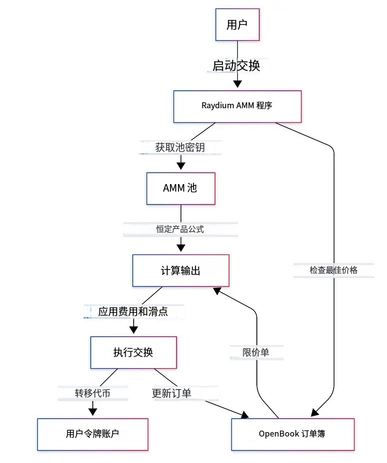

# Raydium 是一个 DeFi 应用

### AMM 的工作原理
- 自动化做市商在池子（智能合约）中持有两种 Token（Token X 和 Token Y）。它允许任何人从池子中提取 Token X，但他们必须存入一定数量的 Token Y，以便池子中资产的“总额”不减少，其中我们将“总额”视为两种资产数量的乘积。

### AMM 公式 
- xy <=x'y'
- 这里 x′ 和 y′ 是交易后池子的 Token 余额，x 和 y 是交易前池子的 Token 余额。
- 这保证了池子的资产持有量只能保持不变或增加。大多数池子都会收取一定费用。余额的乘积不仅应该增加，而且至少应该增加一定数量以支付费用。
- 资产由 流动性提供者 提供给池子，他们收到所谓的 LP Token 来代表他们在池子中的份额。

### AMM 的优点
- 在 AMM 中，价格发现是自动的。它由池子中资产的比例决定。具体来说，如果我们有 Token x 和 Token y，价格的确定方式如下
- price(x) = poolHoldings y / poolHoldings x

### AMM 的价格发现

- y 的价格发现也是如此。具体来说，放入池子中的资产 x 越多，它就越“丰富”，x 的价格就会下降。

- 无需等待合适的“买入”或“卖出”订单出现。它总是存在。如果 AMM 中的价格与另一个交易所的价格不匹配，那么交易者将套利差价，使价格恢复平衡。

- 我们应该强调，这是“现货”或“边际”价格。如果你购买任何数量的 x，你支付的实际价格将比此计算结果更差。

### AMM 的缺点
- 即使是小额订单也会影响 AMM 中的价格。
- 流动性提供者无法控制其资产的售价，并且会遭受无常损失。

### 如何工作
- 恒定乘积原则:这个公式保持了AMM的核心原则，即在交易前后，储备的乘积必须保持不变(因此称为“恒定乘积”)。
- 定价机制:代币的价格由储备的比率动态确定。随着一个代币被购买，它的价格会变得更昂贵(遵循供需曲线)。
- 流动性深度:池储备越大，给定交易对价格的影响就越

- output_amount=(reserve_out x input_amount) /  (reserve_in + input_amount)
- reserve_out:您希望在流动性池中接收的代币数量
- reserve_in:您在流动性池中提供的代币数量
- input_amount: 你要交换/交易的代币数量output amount:你将从交换中获得的代币数量

### Raydium 池子兑换
#### 与仅依赖池子储备的 Uniswap 等传统 AMM 不同，Raydium 与 OpenBook 的集成允许流动性提供者 (LP) 利用更广泛的订单流，从而减少滑点并提高资本效率。
- 无需许可的池子：任何人都可以为任何 Token 对创建池子，从而促进创新。
- 收益机会：LP 赚取交易费用，并且可以参与农场或使用 RAY Token 进行质押。
- 最佳价格兑换：一项评估 AMM 池子与 OpenBook 以获得最佳交易执行的功能。
