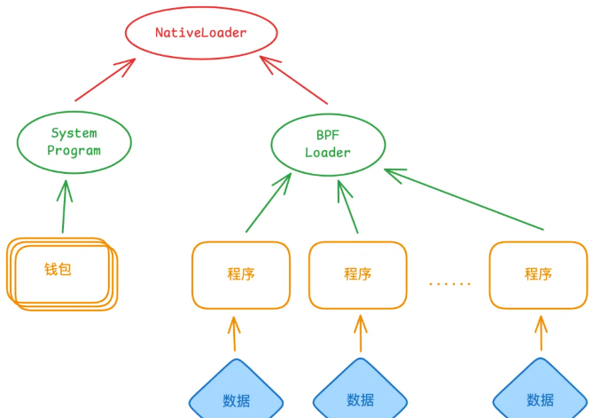
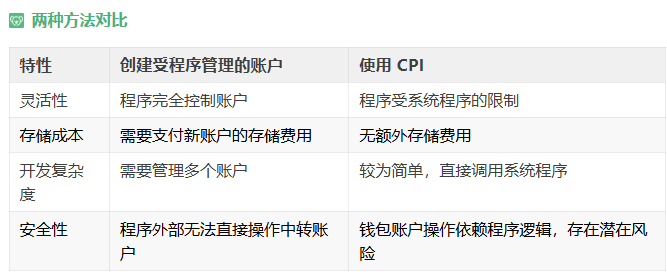

1.程序ID部署不匹配问题
```bash
anchor keys sync
```
2.如何处理账户数据太小的问题？
原因是第一次部署时，程序字节码少，后面添加了代码，字节码变大，导致账户数据太小。
```bash
#1.可以关闭之前的程序，重新部署
#2.扩展 ，账户数据的上线是10M
solana program extend <PROGRAM_ID> <ADDITIONAL_BYTES>
```
3.如何处理计算单位（CUs）超出限制的问题？
```bash
#Solana 程序默认的计算单位限制为 200,000 CUs
# 1.有两种方法可以解决
# 1. 增加 CUs 限制 ,在发送交易前增加计算单位限
const tx = new Transaction().add(
    ComputeBudgetProgram.setComputeUnitLimit({
        units: 300000,
    }),
);
# 2. 优化代码
# 减少不必要的计算
```
- 1.账户相关的信息：
    - 1.账户最大可以存储10M
    - 2.账户关闭全额退回租金
    - 3.每个帐号都有一个程序所有者，只有程序可以修改帐户的数据和余额
    - 4.程序是存储可执行代码的无状态帐户，它不能存储数据，也不能修改数据。
    - 5.数据账户是由程序创建的，用于存储和管理程序的状态。
    - 6.原生程序是随solana运行时一同提供的内置程序
    - 7.Sysvar 帐户是用于存储网络集群状态的特殊账户,网络状态相关的只读信息，如区块时间。
- 2.Acount相关的信息：
    - 1.每个账户对应一个唯一地址：用32 字节的 Ed25519 公钥格式表示
    - 2.每个账户有4个属性：lamports（余额），owner（所有者），executable（是否可执行），data（数据）
    - 3.为了把账户数据存储在链上，需要将一定数量的sol转移到账户中，转移的金额与在存储在账户中的数据大小成正比

- 3.系统程序：
    - 1.只有System Program 能够创建新账户.
    - 2.设置每个账户data字段的字节容量
    - 3.一旦 System Program 创建了一个新账户，它可以将指定的程序所有者重新分配给另一个程序账户。一个新账户刚创建时，所有者都是系统程序，之后系统程序会把所有权转移，分配给用户自定义的程序。
    - 4.只有由系统程序（System Program）拥有的账户才能用作交易费用支付者。

- 在 Solana 上部署新程序时，在技术实现上，会创建三个独立的账户
    - 1.Program Account: 这个是主账户，是代表了链上程序的账户。此账户存储可执行数据账户的地址以及程序的更新权限（即被授权对程序进行更改的地址）。
        - Program Account的地址通常被称为Program ID，它用于调用该程序
    - 2.Program Executable Data Account: 这个是可执行数据账户，一个包含程序可执行字节码的账户。
    - 3.Buffer Account: 这是一个临时账户，用作程序部署过程中使用的缓冲账户。当程序部署或升级时，字节码会被暂时保存到这个账户，直到部署或升级完成。之后，字节码数据会被转移到程序可执行数据账户，而该缓冲账户会被关闭。

### 自定义程序创建数据账户
- 1. 调用系统程序（System Program）来创建一个账户，并将账户的所有权转移给自定义程序。
- 2.  调用自定义程序（现在拥有该账户），然后初始化账户数据，这些数据由程序代码中定义。

### 账户之间的关系图：

### 空账户结构体的实际用途
 - 验证逻辑：某些程序仅用于验证条件，比如检查签名是否有效、某些账户的状态是否符合要求等。
 - 无需持久化状态：当程序的逻辑只依赖现有账户的数据，而不需要新增或修改状态时，空账户结构体是合适的选择。

### 如果我们想编写一个程序来转账 SOL，该如何实现呢？
- 1. 创建受程序管理的账户：使用系统程序（System Program）创建一个账户，并把账户的所有权转移给自定义程序。
- 2. 使用CPI  （Cross-Program Invocation）调用系统程序（System Program）来转移 SOL。


### 如何区分 区分指令和账户的关键
- 1. 每个指令和账户类型分配了一个唯一的 8 字节标识符
    - 对“前缀 + 名称”组合进行 Sha256 哈希。
    - 提取哈希值的前 8 个字节作为结果
### Anchor 框架还会为这个 IDL 文件
- 1. rust 代码里的 蛇形命名（下划线连接），会自动改为 驼峰命名 以遵循 typescript 开发的命名习惯 

### SPL代币标准
- 代币代表对 同质化（可互换） 或 非同质化（独特） 资产的所有权。

- 代币程序包含了与网络上同质化代币和非同质化代币交互的所有指令。

- 扩展代币程序是代币程序的新版本，增加了额外的功能，同时保持了相同的核心功能。

- 铸币账户代表网络上的一种独特代币，并存储全局元数据，如总供应量。

- 代币账户跟踪特定铸币账户的代币的个人所有权。

- 关联代币账户是通过从所有者和铸币账户地址派生的地址创建的代币账户。

### 如何优化 Solana 智能合约的 Gas 消耗？​
- 减少计算量​：避免复杂循环，优先使用常量时间算法
- 数据压缩​：使用 u64 替代 f64，避免浮点运算；用 Vec<u8> 存储紧凑数据
- 批量操作​：合并多个账户操作到单次交易中，减少交易次数