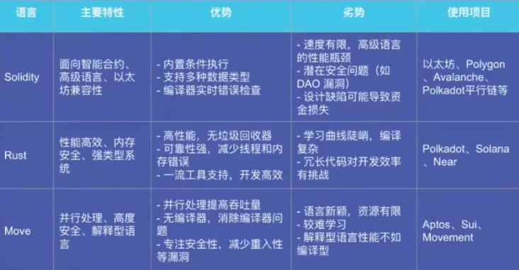

# Web3 行业的发展历程

## 发展阶段

### 第一阶段：2009-2014
- **BTC 主导的1.0时代**，草莽时期。

### 第二阶段：2015-2020
- **ETH 主导的 ICO** + 同期崛起的第二代交易所（如币安），逐步正规化。

### 第三阶段：2020-至今
- **Web3 概念爆发**：NFT、DeFi、GameFi 等概念兴起。
- **去中心化产品**：如 Metamask、OpenSea 等。
- **L2 扩容解决方案**：解决区块链的扩容问题。
- **应用更多，正规军大规模入场**。

## 区块链生态的三大方向

### 历史演变与概念基础
- **Web 1.0**：静态网页，信息展示。
- **Web 2.0**：动态网页，用户交互。
- **Web 3.0**：去中心化，用户数据自主。

### 技术分类（按编程语言）
- **Solidity**：以太坊智能合约语言。
- **Rust**：高性能系统编程语言，应用于区块链开发。
- **Move**：Facebook 的 Libra 区块链编程语言。

### 生态板块
- **公链**：如以太坊、比特币等。
- **去中心化应用（DApp）**：基于区块链的应用。
- **链上工具**：如钱包、浏览器等。
- **加密资产（Token）**：如比特币、以太币等。

## Web3 行业中的 P2E 和 M2E 模式

### P2E (Play-to-Earn)
- **定义**：玩家通过玩游戏赚取加密货币或其他数字资产。
- **应用场景**：GameFi（游戏金融）领域。
- **特点**：玩家可以通过完成任务、参与战斗或交易游戏内物品来获得代币奖励，这些代币可以在市场上兑换成法定货币或其他加密货币。

### M2E (Move-to-Earn)
- **定义**：用户通过步行、跑步或骑自行车等身体活动来赚取加密货币或其他数字奖励。
- **应用场景**：健身类应用程序。
- **特点**：鼓励健康的生活方式，结合了运动和加密货币奖励。

## GameFi 概念

### 定义
GameFi 是 Game Finance 的缩写，即游戏化金融。它融合了 DeFi、NFT 和游戏元素，将去中心化金融产品以游戏的方式呈现。

### 特点
- **资产转化**：玩家的资产转化为游戏内资产或代币资产。
- **流动性挖矿**：通过流动性挖矿提升玩家收益。
- **NFT 化**：游戏道具衍生品 NFT 化，用户资产成为 DeFi 游戏中的装备或工具。

### 历史演变
- **2017 年**：以 Cryptokitties 为代表的收藏交易类游戏兴起，将区块链的“交易属性”和“资产唯一私有特性”与游戏玩法相结合。
- **2019 年**：MixMarvel 首席战略官 Mary Ma 首次提出 GameFi 概念。

### 当前市场
- **产品类型**：角色扮演类、虚拟空间类、养成战斗类、城市经营类。
- **互动性**：相比流动性挖矿模式，GameFi 项目在与用户的互动性、体验性和沉浸感更强。

## Play-to-Earn 模式

### 定义
Play-to-Earn 是一种由区块链技术驱动的商业模式，玩家可以通过充值、玩游戏获得游戏内资产或代币所有权。

### 特点
- **资产所有权**：区块链技术赋予玩家对游戏内资产的所有权。
- **经济模型**：经济模型内循环程度决定了体系维持的时间，扩展性决定了上限。
- **可玩性**：可玩性稳定了下限。

### 与传统游戏的区别
- **收入分配**：传统游戏收入归大型中心化游戏公司，而 Play-to-Earn 游戏收入给到优秀玩家。
- **资产交易**：传统游戏内资产交易仅在游戏生态之中，而区块链游戏允许玩家在平台之外交易或出售其数字资产。

## GameFi 与传统游戏的比较

### 优势
- **更广泛的吸引力**：利用 DeFi 的 Farming 解决了部分前期引流的问题。
- **有助于提高留存率**：Farming 收益有助于提高游戏的玩家留存率。
- **游戏资产私有化**：所有游戏内的个人资产几乎全面 NFT 化，具有可转让和可交易的属性。
- **游戏社区(DAO)的治理权**：大多数 P2E 的终极目标是实现 DAO 治理，让社区（玩家公会）能够参与项目的治理、投票和收益分配。

## GameFi 发展现状

### 第一阶段
- 市场上以革新创新的 NFT 小游戏和养成类小游戏为主，游戏属性不强但由此打开了链游的市场。

### 第二阶段
- 以 Play-to-Earn 和 NFTs 为主要亮点和属性的端游和手游，这类链游具备一定的游戏属性，但更看重其资产价值而不注重玩法。

### 第三阶段
- 在第二阶段的基础上开始研发更高质量的产品，游戏质量大大提升，链游渐渐走入公众视野。

### 第四阶段
- 有更多开发 3A 的游戏厂商进入，或将研发全新游戏，或在其原有生态链上加入区块链技术或元素，NFTs 和 Play-to-earn 成为游戏常态属性。

