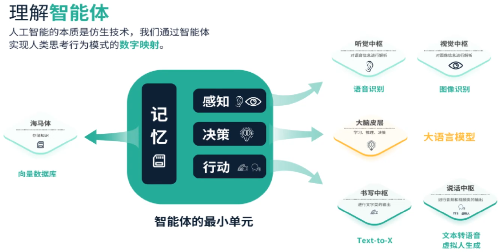
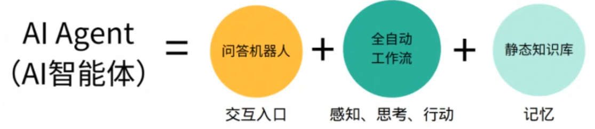
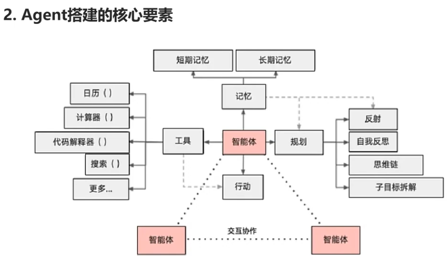
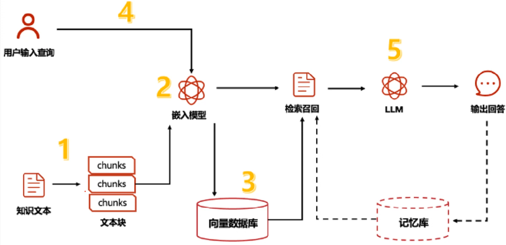

### 提示词工程能解决什么问题?
- 1.核心定位:提示词工程是用户意图与模型能力的桥梁
    - 提示词工程(Prompt Engineering)是通过设计和优化输入指令(Prompt)，引导大模型生成符合预期的输出结果。它解决的核心问题是”如何让模型理解用户需求并精准完成任务”，尤其是在模型本身不可修改(如闭源API调用)的场景下，提示词是开发者控制模型行为的核心工具。
- 2.解决的关键问题
    - (1)任务定义模糊性
        - ·问题:用户需求可能不明确(如“写一篇关于AI的文章”)。
        - 解决:通过提示词细化任务边界(如“以科普风格写一篇面向高中生的A!技术发展史，包含3个案例”)。
        - 场景:内容生成、客服对话中避免开放式回答。
    - (2)输出格式控制
        - ·问题:模型输出可能不符合结构化要求(如JSON、表格、特定代码格式)·
        - 解决:在提示词中明确格式(如“用Markdown表格列出5个新能源车的优缺点”)。
        - 场景:数据抽取、API参数生成、自动化报告。
    - (3)领域知识适配
        - ·问题:通用模型缺乏垂直领域知识(如医疗、法律术语)
        - 解决:通过Few-shot Learning(示例引导)或上下文注入专业知识。
        - ·场景:医疗问答系统、法律文书生成。
    - (4)偏见与安全性控制
        - 问题:模型可能生成有害、偏见或政治敏感内容。
        - 解决:提示词中设置“安全护栏”(如“用中立客观的语言解释气候变化”)。
        - 场景:社交媒体审核、教育内容生成。
    - (5)复杂任务拆解    
        - 问题:单-Prompt难以处理多步骤任务(如数据分析:爬取一清洗一可视化)
        - 解决:通过Chain-of-Thought(思维链)提示分阶段引导模型推理。
        - 场景:代码生成、数学解题、决策支持系统。
- 3.实际开发中的价值
    - (1)降低模型微调成本
        - ·无需重新训练模型即可适配新任务，节省算力和时间(如使用GPT-3处理不同行业客服需求)
    - (2)提升用户体验
        - ·减少“反复调试”的挫败感(如通过优化提示词让AI绘图工具一次性生成符合要求的图像)
    - (3)工程化扩展性
        - 可构建提示词模板库、支持A/B测试不同Prompt效果，形成可复用的解决方案。
### 回答示例
    -  提示词工程主要解决大模型应用中用户意图与模型输出之间的对齐问题。例如，当用户需要模型生成特定格式的数据报告时，通过结构化提示词明确内容框架和输出格式;在医疗咨询场景中，通过Few-shot示例注入专业术语，提升回答准确性。此外，它还能控制模型安全边界，避免生成有害内容。从工程角度看，优秀的提示词设计可以降低对模型微调的依赖，快速适配多样化需求，是提升产品体验和开发效率的关键手段。

### Agent如何搭建?可以用那些框架
- 1.Agent的核心定义
    - AI Agent 是一个能通过感知环境、自主决策、调用工具完成复杂任务的智能体，其核心能力包括
    - 任务拆解(将用户目标分解为子任务)
    - 工具调用(AP1、搜索、代码执行等)
    - 记忆与状态管理(上下文记忆、长期记忆存储)
    - 自我迭代(反思错误、优化策略)    
    
    

- 2.Agent搭建的核心要素
    

    - (1)任务定义与规划
        - 目标解析:通过自然语言理解用户意图(如“帮我分析新能源汽车市场趋势”一 拆解为数据爬取、清洗、分析、可视化等步骤)
        - 规划方法:链式(Chain-of-Thought)、树状(Tree-of-Thought)、图状(Graph-of-Thought)任务分解
        - 工具选择:根据子任务类型选择工具(如爬虫工具、Pandas、Matplotlib)
    - (2)模型层
        - 核心模型:选择基础大模型(如GPT-4、Claude、LLAMA 2)作为推理引擎角色设定:通过System Prompt定义Agent
        - 角色(如“你是一个资深数据分析师”)微调
        - 需求:是否需要领域微调(如医疗、金融场景)
    - (3)工具库集成
        - 内置工具:代码解释器、数学计算、文件读写
        - 外部API:搜索引擎(SerpAPI)、数据库(SQLAlchemy)、云服务(AWSS3)
        - 自定义工具:业务特定工具(如内部CRM系统接口)
    - (4)记忆系统
        - 短期记忆:上下文窗口管理(如GPT-4的8k/32k Token限制)
        - 长期记忆:向量数据库(Pinecone、Milvus)存储历史交互
        - 优先级策略:关键信息提取与缓存(如用户偏好、任务历史)
    - (5)安全与可控性
        - 权限控制:限制敏感工具调用(如删除文件、支付接口)
        - 输出审核:敏感词过滤、事实性校验(如调用FactCheck API)
        - 失败回退:错误重试、人工接管机制
- 3.Agent开发框架推荐
    - (1)LangChain
        - 特点:模块化设计，支持Chain/Agent/Memory/Tools组件
        - 适用场景:快速构建工具调用型Agent(如文档问答、数据分析)
    - (2)AutoGPT(开源项目)
        - 特点:自主目标驱动，支持长期记忆和互联网访问
        - 适用场景:自动化研究、多步骤任务执行(如市场调研报告生成)
    - (3)Microsoft Guidance
        - 特点:基于模板的高精度输出控制，支持推理过程约束
        - 适用场景:需要严格格式要求的场景(如JSON生成、代码补全
    - (4)Hugging Face Transformers Agents
        - 特点:与Hugging Face模型/数据集生态深度集成适用场景:结合自定义微调模型的Agent(如医疗诊断助手)
    - (5)开源项目
        - ·BabyAGI:轻量级任务驱动型Agent(适合学习原理)SuperAGl:支持可视化编排的企业级框架
        - MetaGPT:面向软件开发的Agent(自动生成PRD/代码/测试)

- 4.搭建流程示例(以电商客服Agent为例)
    - 1.需求定义:处理用户退货、订单查询、推荐商品
    - 2.工具集成
        - 内部AP1:订单数据库查询接口
        - 外部工具:物流信息API(如快递100)
        - 自定义工具:退货政策检查器
    - 3.提示词设计:
    ```text
        Role:你是XX电商客服助手，语气亲切专业。
        Steps:
        1.确认用户订单号
        2.根据问题类型调用对应工具3.若问题复杂，转接人工客服
    ```
    - 4.测试优化:
        - 使用LangChain的AgentExecutor进行对话流测试
        - 通过A/B测试比较不同提示词版本的解决率
- 5.回答示例
    - “搭建Agent需要围绕任务规划、工具调用、记忆管理三个核心模块。例如在电商场景中，我们可以用LangChain初始化一个客服Agent:通过System Prompt设定角色，集成订单查询API作为工具，用Milvus向量库存储历史对话。开发中需重点解决工具调用的稳定性--比如处理API超时重试，以及通过Guidance模板约束输出格式。主流框架如LangChain适合快速原型开发，而SuperAGI等开源项目提供可视化编排，适合复杂任务流。

### 详细说下RAG的流程
 ```
 1.用户输入处理:解析查询，可能进行意图识别、实体识别、查询扩展等
 2.文档检索:使用检索方法从文档库中找到相关段落，可能需要预处理和索引。
 3.文档处理:对检索结果进行排序、去重、截断或摘要
 4.信息整合:将处理后的文档和原查询结合，输入生成模型。
 5.生成回答:生成模型产生回答，可能包括多步推理。
 6.后处理:对生成的回答进行格式化、去重、事实校验等。
 ```
 

 - 1.用户输入处理
    - 目标:解析并理解用户查询的意图和关键信息。
    - 关键技术:
    - 查询解析:提取关键词、实体识别(如NER)、语义解析(理解深层意图)
    - 查询扩展:通过同义词替换、上下文联想(例如，用户问“Transformer结构”时，补充“注意力机制”相关术语)增强检索效果。
    - 向量化:将查询转换为向量表示(如使用BERT、Sentence-BERT等模型)，便于后续向量检索。

- 2.文档检索
    - 目标:从外部知识库中快速找到与查询最相关的文档或段落。
    - 关键技术:
        - 索引构建:预处理知识库文档，构建高效的索引结构(如倒排索引、向量索引FAISS/HNSW)
        - 检索算法:
            - 稀疏检索:基于词频的方法(如BM25)，适合关键词匹配。
            - 密集检索:基于语义相似度的向量匹配(如DPR、ANCE模型)
        - 多路召回:结合多种检索策略(如同时用BM25和向量检索)，提升召回率

- 3.文档后处理
    - 目标:优化检索结果，确保输入生成模型的信息质量。
    - ·关键技术
        - 根据相关性(如相似度分数)或多样性筛选结果。去重与排序:
        - 截断与分块:处理长文本(如滑动窗口截断)，适配生成模型的输入长度限制。
        - 上下文增强:添加元信息(如文档来源、时间戳)供生成模型参考。
- 4.生成回答
    - 目标:基于检索结果和用户输入生成自然、准确的回答。
    - 关键技术:
        - 提示工程:将检索到的文档与用户查询拼接为生成模型的输入(Prompt)，例如:
    ```text
    [查询1:量子计算的优势是什么?
    [相关文档11:量子计算利用量子比特实现并行计算...
    [相关文档2]:量子算法在加密破解领域有潜在应用...
    「生成任务1:请综合上述信息，回答用户的问题。
    生成模型选择:使用预训练生成模型(如GPT-3、T5、BART)进行条件文本生成可控生成:通过Temperature调整、Top-k采样等控制生成结果的多样性和准确性
    ```
- 生成模型选择:使用预训练生成模型(如GPT-3、T5、BART)进行条件文本生成。
- 可控生成:通过Temperature调整、Top-k采样等控制生成结果的多样性和准确性。

- 5.后处理与验证
    - 目标:优化生成结果的格式和事实准确性。
    - 关键技术:
    - 文本润色:去除重复内容、语法纠错、调整句式。
    - 事实核验:对比检索结果与生成内容，确保一致性(如使用NLI模型验证逻辑)
    - 引用标注:标明答案的来源文档(增强可信度)

- 技术挑战与优化方向
    - 检索质量:如何平衡召回率与精度，处理长尾查询。
    - 生成与检索的协同:联合训练检索器和生成器(如Facebook的原始RAG模型)以提升端到端效果。
    - 效率优化:减少检索延迟(如使用近似最近邻搜索)、压缩生成模型规模。
    - 示例场景
        - 用户提问:“如何解决深度学习模型过拟合?
        - 1.检索阶段:从知识库中找到相关文档(如“Dropout的作用”“数据增强方法”)。
        - 2.生成阶段:模型综合检索结果，生成包含正则化、早停法等技术的回答，并引用来源。

- 总结回答
- 在面试中，可以按以下结构回答
- 1.定义RAG:强调其结合检索与生成的优势。
- 2.分步拆解流程:输入处理一检索一文档处理一生成一后处理，
- 3.关键技术点:密集检索、提示工程、联合训练等。
- 4.结合实际案例:简要举例说明流程如何运作。
通过清晰的逻辑和具体技术术语，展现对RAG的深入理解.