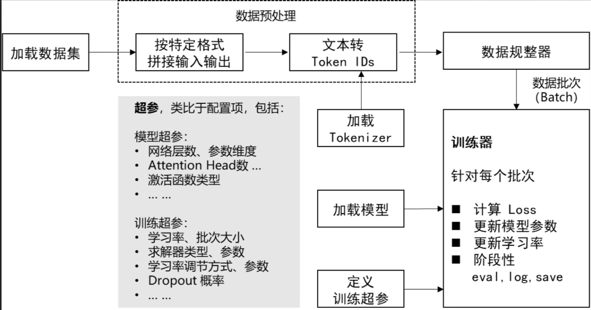

### 大模型微调流程是怎样的?

- 任务定义与数据准备1.
    - 明确任务目标:确定微调任务类型(如文本分类、实体识别、生成任务等)，明确评估指标(如准确率
F1值、BLEU等)。

    - 数据收集与标注:收集与任务相关的数据，确保数据质量和多样性;对非监督任务可能需要标注(如分类标签、实体标签)
    - 数据划分:将数据分为训练集、验证集和测试集(常用比例如80%-10%-10%)，验证集用于调参，测试集用于最终评估。
- 2.数据预处理与增强
    - 格式转换:将数据转换为模型输入格式(如BERT的[CLS]+文本+[SEP])。
    - 分词(Tokenization):使用预训练模型的对应分词器(如BERT的WordPiece)
    - 数据增强:在数据量不足时，采用回译、随机遮盖、同义词替换等方法扩充数据，提升泛化性。
- 3.模型选择与结构调整
    - 选择预训练模型:根据任务选择合适的基础模型(如BERT用于理解任务，GPT-3用于生成任务)
    - 调整模型结构:
        - 全参数微调:直接更新所有参数，适用于数据充足且任务差异较大的场景。
        - 参数高效微调:如LORA(低秩适应)、Adapter(插入适配层)，仅训练少量参数，节省计算资源。
        - 添加任务层:例如在分类任务中，添加全连接层输出类别概率。

- 4.训练超参数与优化策略
    - 学习率设置:通常使用较小的学习率(如1e-5到5e-5)，避免破坏预训练特征
    - 优化器选择:常用AdamW，配合权重衰减(Weight Decay)防止过拟合。
    - 训练技巧:
        - 分层学习率:不同层设置不同学习率(底层参数更新更慢)
        - 梯度裁剪:防止梯度爆炸。
        - 早停(Early Stopping):根据验证集表现终止训练。
        - 混合精度训练:使用FP16加速训练，节省显存。
- 5.训练与验证监控
    - 训练过程:在训练集上迭代更新参数，同时监控训练损失和验证集指标
    - 防止过拟合:通过Dropout、数据增强、正则化(L2)等手段提升泛化能力。
- 6.模型评估与迭代优化
    - 测试集评估:使用保留的测试集计算最终指标，确保模型未过拟合验证集。
    模型评估与迭代优化测试集评估:使用保留的测试集计算最终指标，确保模型未过拟合验证集错误分析:分析模型在特定样本上的错误，针对性优化数据或模型结构超参数调优:通过网格搜索或工具(如Optuna)优化学习率、批次大小等。

- 7模型部署与持续迭代
    - 模型导出:将模型转换为生产格式(如ONNX、TensorRT)以提升推理效率，
    - 监控与更新:部署后监控线上表现，定期用新数据重新微调(持续学习)
    - 轻量化处理:通过量化(Quantization)、剪枝(Pruning)压缩模型，适应边缘设备。 

#### 示例回答 
- 大模型微调的流程通常从明确任务目标开始，例如分类或生成任务，接着收集和预处理相关数据。数据需要被分词并转换为模型输入格式，如添加特殊标记。之后，选择合适的预训练模型(如BERT或GPT)，并根据任务调整结构，比如添加分类层。训练时采用较小的学习率和优化策略(如AdamW)，同时监控验证集指标以防止过批合。最后，通过测试集评估模型，并部署到生产环境，持续迭代优化

### 模型微调怎么评估效果?
