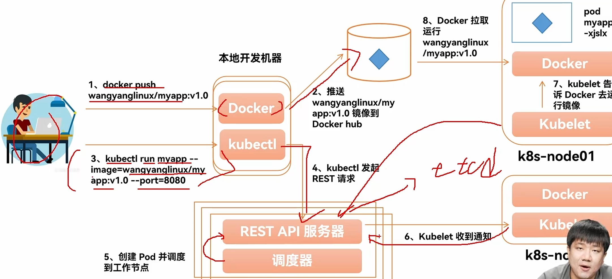

### 01.什么是资源
- 资源是k8s集群中的一个实体，例如节点、pod、service、deployment等。
### 资源类别
#### 名称空间级别
- 工作负载型资源:Pod、ReplicaSet、Deployment .
- 服务发现及负载均衡型资源:Service、Ingress.
- 配置与存储型资源:Volume、CSl
- 特殊类型的存储卷:ConfigMap、Secre.
#### 集群级资源
- Namespace、Node、ClusterRole、ClusterRoleBinding
#### 元数据型资源
- HPA、PodTemplate、LimitRange


02.资源清单的编写
```
apiVersion: v1 # group/apiversion 接口组/版本
kind: Pod # 资源类型
metadata: # 元数据
  name: my-pod # 资源名称
  namespace: default # 名称空间
  labels:
    app: my-app # 标签
spec:   # 期望状态
  containers: # 容器
    - name: my-container # 容器名称
      image: my-image:latest # 容器镜像
      ports:
        - containerPort: 80 # 容器端口
status: # 当前状态
  phase: Running # 容器状态
  conditions: # 容器状态
    - type: Ready # 容器状态
      status: "True" # 容器状态
      lastProbeTime: "2024-02-20T12:00:00Z" # 容器状态
      lastTransitionTime: "2024-02-20T12:00:00Z" # 容器状态
      reason: "ContainerReady" # 容器状态
      message: "Container is ready" # 容器状态
```
#### pod demo
```yaml
apiVersion: v1
kind: Pod
metadata:
  name: busybox-pod
  labels:
    app: busybox
spec:
  containers:
  - name: busybox
    image: busybox:latest
    command: ['sh', '-c', 'echo "Hello from busybox!" && sleep 3600']
  restartPolicy: Always
```


03.Pod 的生命周期

Pod 的生命周期包括以下几个阶段：

1. Pending：Pod 已经被 Kubernetes 系统接受，但有一个或者多个容器镜像尚未创建。等待时间包括调度 Pod 的时间和通过网络下载镜像的时间。

2. Running：Pod 已经绑定到了一个节点上，Pod 中所有的容器都已被创建。至少有一个容器正在运行，或者正处于启动或重启状态。

3. Succeeded：Pod 中的所有容器都被成功终止，并且不会再重启。

4. Failed：Pod 中的所有容器都已终止了，并且至少有一个容器是因为失败终止。也就是说，容器以非0状态退出或者被系统终止。

5. Unknown：因为某些原因无法取得 Pod 的状态，这种情况通常是因为与 Pod 所在主机通信失败。

Pod 的生命周期还包括以下重要概念：

- 初始化容器（Init Containers）：在应用容器启动之前运行的专用容器，用于执行一些初始化操作。

- 容器探针（Probes）：
  - 存活探针（Liveness Probe）：用于检测容器是否还在运行。
  - 就绪探针（Readiness Probe）：用于检测容器是否准备好接收流量。
  - 启动探针（Startup Probe）：用于检测应用程序是否已经启动。

- 重启策略（Restart Policy）：定义了 Pod 中容器终止后的重启策略。

- Pod 终止（Pod Termination）：当 Pod 被删除时，Kubernetes 会发送 SIGTERM 信号给容器，并等待一定时间（默认30秒）后发送 SIGKILL 信号。

理解 Pod 的生命周期对于有效管理和调试 Kubernetes 应用程序至关重要。

04.Pod 是如何被调度运行的

