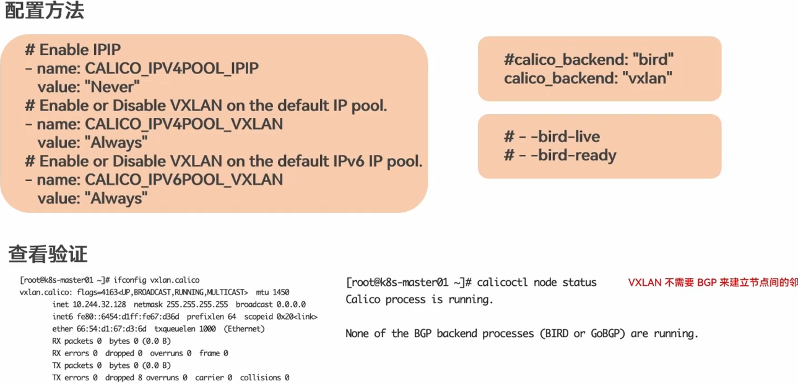

# kubernetes 网络

### 在不使用网络地址转换(NAT)的情况下，集群中的 Pod 能够与任意其他 Pod 进行通信在不使用网络地址转换(NAT)的情况下，
### 在集群节点上运行的程序能与同一节点上的任何Pod 进行通信
### 每个 Pod 都有自己的IP 地址(IP-per-Pod)，并且任意其他 Pod 都可以通过相同的这个地址访问它

## cni -1
借助 CNI标准，Kubernetes 可以实现容器网络问题的解决。通过插件化的方式来集成各种网络插件，实现集群内部网络相互通信，只要实现CNI标准中定义的核心接口操作(ADD，将容器添加到网络;DEL，从网络中删除一个容器;CHECK，检查容器的网络是否符合预期等)。CNI插件通常聚焦在容器到容器的网络通信。

### Kubernetes 节点默认的 CNI插件路径为/opt/cni/bin
###  CNI的接口并不是指 HTTP,gRPC这种接口，CN接口是指对可执行程序的调用(exec)可执行程序

#### calico 
calico 是一个开源的网络和网络安全解决方案，主要用于在 Kubernetes 集群中提供网络连接和安全性。Calico 支持多种网络模型，包括 BGP（Border Gateway Protocol）和 IPIP（IP in IP），以满足不同部署环境的需求。

Calico 的主要特点包括：

1. 网络策略：Calico 支持基于 IP 地址的网络策略，允许用户定义哪些 Pod 可以相互通信，哪些不能。这对于安全性至关重要。
2. 网络模型：Calico 支持多种网络模型，包括 BGP 和 IPIP，以满足不同部署环境的需求。
3. 灵活性：Calico 支持多种网络拓扑，包括扁平网络和分层网络，以适应不同的网络架构。
4. 高性能：Calico 使用高效的网络协议和数据包处理技术，以提供高性能的网络连接。

### IPIP
IPIP 是一种隧道技术，用于在两个网络之间传输数据包。在 Calico 中，IPIP 用于在不同节点上的 Pod 之间提供网络连接。
- Linux 内核支持
- IPIP 隧道工作原理 
是将源IP 数据包封装在另一个IP 数据包中，通过另一个网络进行传输，然后在目的地解封装，恢复原始数据包。
### BGP
BGP（Border Gateway Protocol）是一种用于在网络设备之间交换路由信息的协议。在 Calico 中，BGP 用于在不同节点上的 Pod 之间提供网络连接。

### 网络策略
网络策略是一种安全机制，用于在 Kubernetes 集群中定义哪些 Pod 可以相互通信，哪些不能。在 Calico 中，网络策略基于 IP 地址和网络拓扑来定义。

