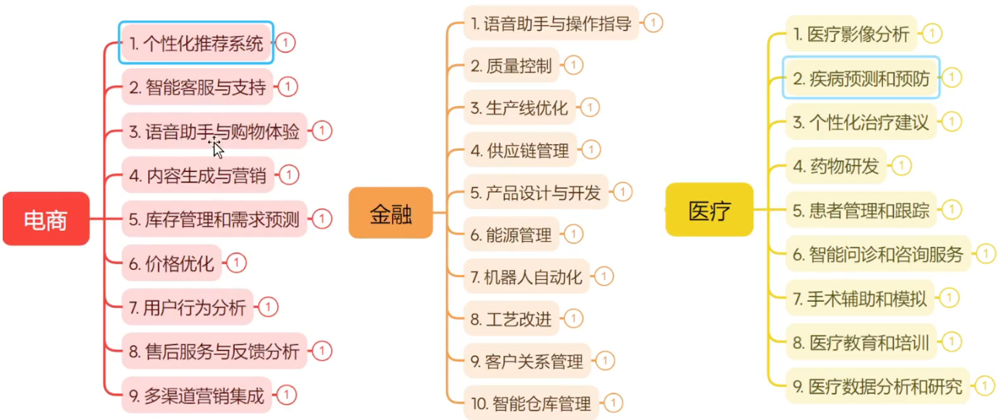

### AI Agent 基础概念
- AI Agent 是一个智能代理，它由一个智能体和一组工具组成。
 -AI Agent (AI智能体) = 问答机器人 + 全自动工作流 + 静态知识库
                        交互入口  感知、思考、行动  记忆
### Agent 与其他AI协同的区别

### AI Agent 核心框架

### AI Agent 企业级需求场景

### 应用级开发者该如何拥抱AIGC

### 场景 上了解模型，下了解行业

### 开发一个人性化的具备专业知识的AI Agent
