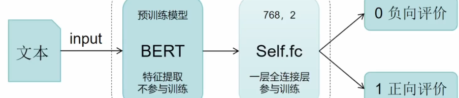

### 开发一个AI项目的步步骤
- 1.判定这个需求是否是一个AI需求?
    - 当前的AI技术是否能够实现，
    - 能实现，则是AI需求
- 2.需要数据集，数据收集与制作
    - 高质量的数据
    - 工作量花费时间最长 ([huggingface](https://huggingface.co/))
    - 6个月，3-4个月
- 3.模型设计
   - 基于 基座模型(预训练模型)来进行下游任务的实现
   - 1)给定一个文本
   - 2)上游任务(主干网络)模型负责 提取文本特征(输出结果)
    采用 Bert 模型来提取文本特征
        - label: 1
        - score: 0.9
   - 3)将输出的结果给到下游任务模型
    - 自己设计模型

- 4.开始模型训练

4. 模型评估