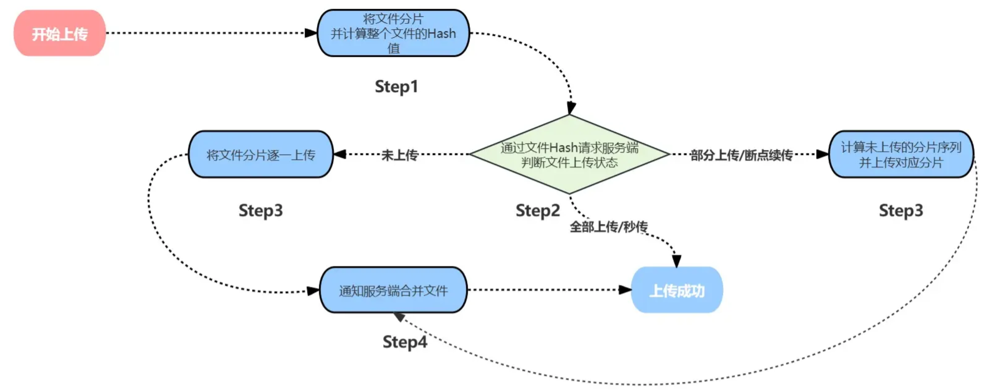

###
#### 安装 multer 的 ts 类型的包
```
npm install @types/multer --save-dev
```

```
cd client
http-server -p 8000
```
### 前端整体流程
- 第一步：将文件进行分片，并计算其Hash值（文件的唯一标识）
- 第二步：发送请求，询问服务端文件的上传状态
- 第三步：根据文件上传状态进行后续上传
    - 文件已经上传过了
    - 结束 --- 秒传功能
    - 文件存在，但分片不完整
    - 将未上传的分片进行上传 --- 断点续传功能
    - 文件不存在
    - 将所有分片上传
- 第四步：文件分片全部上传后，发送请求通知服务端合并文件分片



### 优化
- Webasmbly--可以利用其他高效语言转换为WASM交给浏览器执行

- 不再Hash整个文件，而是采用一些其他策略