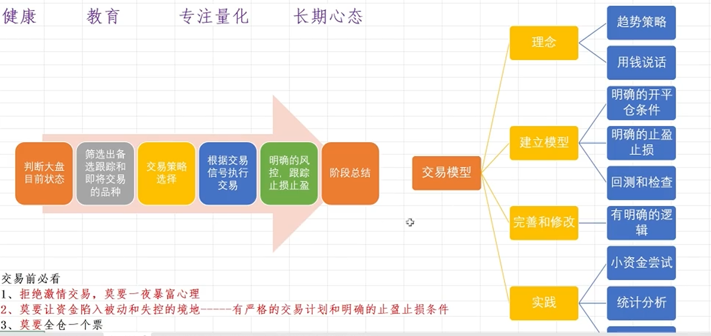

### 高频量化的目的和特点
 - 特点
    - 1. 高胜率、低赔率
    - 2. 蚂蚁搬家，积少成多
    - 3. 容量相对小
    - 4、 策略容易失效，需要不断迭代
    - 适合小资金做大

#### 高频交易框架： 所有的交易框架本质是一样的
 - step1: 获取高频tick行情，计算相应指标
 - step2: 产生交易信号signal （多空仓），进而建仓
 - step3: 对于持仓进行仓位管理：浮盈加仓/做T/直接止盈止损等等
 - 如止循环往复，逐步积累利润    

## 三步：麻雀变凤凰
### 策略研发
### 量化部署
### 交易迭代

## 分析与交易体系
 
### 基本操作:用逻辑指导行动基本假设:市场长时间来看是有效的，中长期的发展是符合客观经济规律的发展的
 - 1、大道至简，低买高卖，忘记时间，这是股票的核心逻辑(制度只能做多)
 - 2、信息的传递和解读都是不完美的，同样的信息导致不同的解读，进而反应在股市上就是:
 - 3、人性的弱点，贪婪和恐惧导致的追涨杀跌
 - 战略层次:解决打不打的问题，胜而求战。

### 凯利工式，解决仓位和胜率的问题

## 交易前必看
### 1、拒绝激情交易，莫要一夜暴富心理
### -----有严格的交易计划和明确的止盈立损条件2、莫要让资金陷入被动和失控的境地
### 3、莫要全仓一个票
### 期望为正，模型稳健，始终坚持

### 交易绝招:以可接受的成本博最大收益
### 量化交易唯一吸引力:个人勤奋努力变现的绝好工具、
### 量化:只是工具，很卷
### 交易:策略是基础，最终是心态，难以复制
### 量化交易:科学+艺术=复利
### 素质要求
 - 贪生怕死不入此门首先性格:
 - 长期坚持:心存敬思，如履薄冰
 - 有一定的学习能力，习惯性自己解决问题，有任性

### 什么是高频交易?
- 就是速度快的交易，每0.5s交易一次，因为目前交易所给出tick行情最快是0.5s
### 高频交易本质是什么?
- 高胜率的交易，重点在于交易信号和止盈止损
### 高频交易的优劣势?
- 优势:策略有效的情况下，总能赚钱，回撤很小
- 劣势:因为速度快，频次高，所以需要考虑盘口(不能自己割自己韭关)，容量不大，而且容易失效
### 为什么做高频交易?
- 小资金做大的不错选择