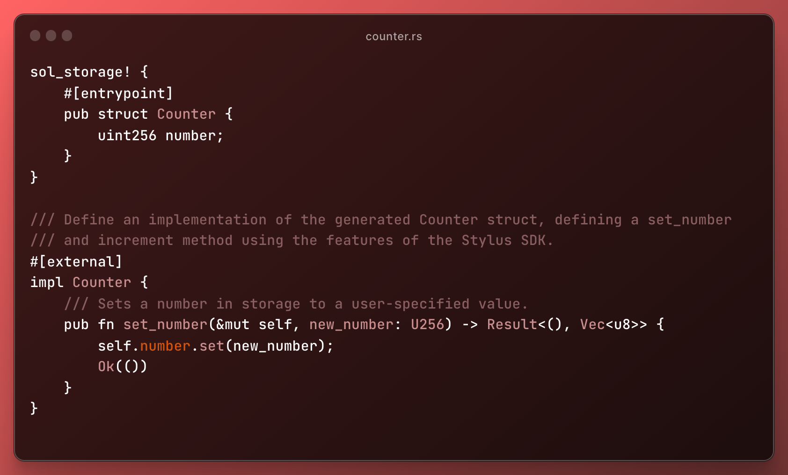

### 获取合约的接口
```shell
cargo stylus export-abi
```
```shell output
/**
 * This file was automatically generated by Stylus and represents a Rust program.
 * For more information, please see [The Stylus SDK](https://github.com/OffchainLabs/stylus-sdk-rs).
 */

// SPDX-License-Identifier: MIT-OR-APACHE-2.0
pragma solidity ^0.8.23;

interface ICounter  {
    function number() external view returns (uint256);

    function setNumber(uint256 new_number) external;

    function mulNumber(uint256 new_number) external;

    function addNumber(uint256 new_number) external;

    function increment() external;

    function addFromMsgValue() external payable;
}
```


### 验证 Stylus 项目
```shell
#执行如下命令来验证该程序是否能够在链上成功部署和激活，但并不进行实际的部署
 cargo stylus check -e https://sepolia-rollup.arbitrum.io/rpc
```
```shell output
    Finished `release` profile [optimized] target(s) in 42.33s
stripped custom section from user wasm to remove any sensitive data
contract size: 6.4 KB (6353 bytes)
wasm size: 19.5 KB (19511 bytes)
File used for deployment hash: ./Cargo.lock
File used for deployment hash: ./Cargo.toml
File used for deployment hash: ./examples/counter.rs
File used for deployment hash: ./rust-toolchain.toml
File used for deployment hash: ./src/lib.rs
File used for deployment hash: ./src/main.rs
project metadata hash computed on deployment: "685e3cd6d6f8eeb9d74f9765b9871e81b67df06608b4f14343baeebc0c7cdc8e"
stripped custom section from user wasm to remove any sensitive data
contract size: 6.4 KB (6353 bytes)
wasm data fee: 0.000073 ETH (originally 0.000061 ETH with 20% bump)
```

### 计算部署所需的 gas 费
```shell
cargo stylus deploy \
	--endpoint=https://sepolia-rollup.arbitrum.io/rpc \
  --private-key=<YOUR_PRIVATE_KEY> \
  --estimate-gas
cargo stylus deploy \
	--endpoint=https://sepolia-rollup.arbitrum.io/rpc \
  --private-key=$PKEY \
  --estimate-gas

stripped custom section from user wasm to remove any sensitive data
contract size: 6.4 KB (6359 bytes)
wasm size: 19.5 KB (19507 bytes)
File used for deployment hash: ./Cargo.lock
File used for deployment hash: ./Cargo.toml
File used for deployment hash: ./examples/counter.rs
File used for deployment hash: ./rust-toolchain.toml
File used for deployment hash: ./src/lib.rs
File used for deployment hash: ./src/main.rs
project metadata hash computed on deployment: "685e3cd6d6f8eeb9d74f9765b9871e81b67df06608b4f14343baeebc0c7cdc8e"
stripped custom section from user wasm to remove any sensitive data
contract size: 6.4 KB (6359 bytes)
estimates
deployment tx gas: 1440596
gas price: "0.100000000" gwei
deployment tx total cost: "0.000144059600000000" ETH

```
### 部署合约
```shell
cargo stylus deploy \
	--endpoint=https://sepolia-rollup.arbitrum.io/rpc \
  --private-key=<YOUR_PRIVATE_KEY>

cargo stylus deploy \
	--endpoint=https://sepolia-rollup.arbitrum.io/rpc \
  --private-key=$PKEY \
  --max-fee-per-gas-gwei=0.3
```
```shell output
project metadata hash computed on deployment: "685e3cd6d6f8eeb9d74f9765b9871e81b67df06608b4f14343baeebc0c7cdc8e"
stripped custom section from user wasm to remove any sensitive data
contract size: 6.4 KB (6359 bytes)
deployed code at address: 0x0006d40d4a1a8ae4a89c3abb2d949d022a0b2cb2
deployment tx hash: 0xc9432f595a14b52735d2d26993861637c6af1c6a78eacf9f718c15ded6e6a54e
wasm already activated!
```
### 测试 
```
<YOUR_ARCHITECTURE> = rustc -vV | grep host
cargo run --example counter --target=<YOUR_ARCHITECTURE>

cargo run --example counter --target=x86_64-unknown-linux-gnu
```

```shell output
ounter number value = Ok(0)
Receipt = TransactionReceipt { transaction_hash: 0x6ffea99ca1fc5f6c022c6a8ce61a1f5f68e92e870d4d3d5267abb93b858b9298, transaction_index: 11, block_hash: Some(0x108e33c71ee4f590d1ae0a7dd4c75a57098785de1fd1d9e8e5ee5651e30ef56d), block_number: Some(155219197), from: 0xe96cfdc8f44c12270acada7f9140c8a99bd185db, to: Some(0x0006d40d4a1a8ae4a89c3abb2d949d022a0b2cb2), cumulative_gas_used: 1676663, gas_used: Some(44335), contract_address: None, logs: [], status: Some(1), root: None, logs_bloom: 0x00000000000000000000000000000000000000000000000000000000000000000000000000000000000000000000000000000000000000000000000000000000000000000000000000000000000000000000000000000000000000000000000000000000000000000000000000000000000000000000000000000000000000000000000000000000000000000000000000000000000000000000000000000000000000000000000000000000000000000000000000000000000000000000000000000000000000000000000000000000000000000000000000000000000000000000000000000000000000000000000000000000000000000000000000000000, transaction_type: Some(2), effective_gas_price: Some(100000000), other: OtherFields { inner: {"gasUsedForL1": String("0x0"), "l1BlockNumber": String("0x7fc736"), "timeboosted": Bool(false)} } }
Successfully incremented counter via a tx
New counter number value = Ok(1)
```




# Stylus Hello World

Project starter template for writing Arbitrum Stylus programs in Rust using the [stylus-sdk](https://github.com/OffchainLabs/stylus-sdk-rs). It includes a Rust implementation of a basic counter Ethereum smart contract:

```js
// SPDX-License-Identifier: UNLICENSED
pragma solidity ^0.8.13;

contract Counter {
    uint256 public number;

    function setNumber(uint256 newNumber) public {
        number = newNumber;
    }

    function increment() public {
        number++;
    }
}
```

To set up more minimal example that still uses the Stylus SDK, use `cargo stylus new --minimal <YOUR_PROJECT_NAME>` under [OffchainLabs/cargo-stylus](https://github.com/OffchainLabs/cargo-stylus).

## Quick Start 

Install [Rust](https://www.rust-lang.org/tools/install), and then install the Stylus CLI tool with Cargo

```bash
cargo install --force cargo-stylus cargo-stylus-check
```

Add the `wasm32-unknown-unknown` build target to your Rust compiler:

```
rustup target add wasm32-unknown-unknown
```

You should now have it available as a Cargo subcommand:

```bash
cargo stylus --help
```

Then, clone the template:

```
git clone https://github.com/OffchainLabs/stylus-hello-world && cd stylus-hello-world
```

### Testnet Information

All testnet information, including faucets and RPC endpoints can be found [here](https://docs.arbitrum.io/stylus/reference/testnet-information).

### ABI Export

You can export the Solidity ABI for your program by using the `cargo stylus` tool as follows:

```bash
cargo stylus export-abi
```

which outputs:

```js
/**
 * This file was automatically generated by Stylus and represents a Rust program.
 * For more information, please see [The Stylus SDK](https://github.com/OffchainLabs/stylus-sdk-rs).
 */

interface Counter {
    function setNumber(uint256 new_number) external;

    function increment() external;
}
```

Exporting ABIs uses a feature that is enabled by default in your Cargo.toml:

```toml
[features]
export-abi = ["stylus-sdk/export-abi"]
```

## Deploying

You can use the `cargo stylus` command to also deploy your program to the Stylus testnet. We can use the tool to first check
our program compiles to valid WASM for Stylus and will succeed a deployment onchain without transacting. By default, this will use the Stylus testnet public RPC endpoint. See here for [Stylus testnet information](https://docs.arbitrum.io/stylus/reference/testnet-information)

```bash
cargo stylus check
```

If successful, you should see:

```bash
Finished release [optimized] target(s) in 1.88s
Reading WASM file at stylus-hello-world/target/wasm32-unknown-unknown/release/stylus-hello-world.wasm
Compressed WASM size: 8.9 KB
Program succeeded Stylus onchain activation checks with Stylus version: 1
```

Next, we can estimate the gas costs to deploy and activate our program before we send our transaction. Check out the [cargo-stylus](https://github.com/OffchainLabs/cargo-stylus) README to see the different wallet options for this step:

```bash
cargo stylus deploy \
  --private-key-path=<PRIVKEY_FILE_PATH> \
  --estimate-gas
```

You will then see the estimated gas cost for deploying before transacting:

```bash
Deploying program to address e43a32b54e48c7ec0d3d9ed2d628783c23d65020
Estimated gas for deployment: 1874876
```

The above only estimates gas for the deployment tx by default. To estimate gas for activation, first deploy your program using `--mode=deploy-only`, and then run `cargo stylus deploy` with the `--estimate-gas` flag, `--mode=activate-only`, and specify `--activate-program-address`.


Here's how to deploy:

```bash
cargo stylus deploy \
  --private-key-path=<PRIVKEY_FILE_PATH>
```

The CLI will send 2 transactions to deploy and activate your program onchain.

```bash
Compressed WASM size: 8.9 KB
Deploying program to address 0x457b1ba688e9854bdbed2f473f7510c476a3da09
Estimated gas: 1973450
Submitting tx...
Confirmed tx 0x42db…7311, gas used 1973450
Activating program at address 0x457b1ba688e9854bdbed2f473f7510c476a3da09
Estimated gas: 14044638
Submitting tx...
Confirmed tx 0x0bdb…3307, gas used 14044638
```

Once both steps are successful, you can interact with your program as you would with any Ethereum smart contract.

## Calling Your Program

This template includes an example of how to call and transact with your program in Rust using [ethers-rs](https://github.com/gakonst/ethers-rs) under the `examples/counter.rs`. However, your programs are also Ethereum ABI equivalent if using the Stylus SDK. **They can be called and transacted with using any other Ethereum tooling.**

By using the program address from your deployment step above, and your wallet, you can attempt to call the counter program and increase its value in storage:

```rs
abigen!(
    Counter,
    r#"[
        function number() external view returns (uint256)
        function setNumber(uint256 number) external
        function increment() external
    ]"#
);
let counter = Counter::new(address, client);
let num = counter.number().call().await;
println!("Counter number value = {:?}", num);

let _ = counter.increment().send().await?.await?;
println!("Successfully incremented counter via a tx");

let num = counter.number().call().await;
println!("New counter number value = {:?}", num);
```

Before running, set the following env vars or place them in a `.env` file (see: [.env.example](./.env.example)) in this project:

```
RPC_URL=https://sepolia-rollup.arbitrum.io/rpc
STYLUS_CONTRACT_ADDRESS=<the onchain address of your deployed program>
PRIV_KEY_PATH=<the file path for your priv key to transact with>
```

Next, run:

```
cargo run --example counter --target=<YOUR_ARCHITECTURE>
```

Where you can find `YOUR_ARCHITECTURE` by running `rustc -vV | grep host`. For M1 Apple computers, for example, this is `aarch64-apple-darwin` and for most Linux x86 it is `x86_64-unknown-linux-gnu`

## Build Options

By default, the cargo stylus tool will build your project for WASM using sensible optimizations, but you can control how this gets compiled by seeing the full README for [cargo stylus](https://github.com/OffchainLabs/cargo-stylus). If you wish to optimize the size of your compiled WASM, see the different options available [here](https://github.com/OffchainLabs/cargo-stylus/blob/main/OPTIMIZING_BINARIES.md).

## Peeking Under the Hood

The [stylus-sdk](https://github.com/OffchainLabs/stylus-sdk-rs) contains many features for writing Stylus programs in Rust. It also provides helpful macros to make the experience for Solidity developers easier. These macros expand your code into pure Rust code that can then be compiled to WASM. If you want to see what the `stylus-hello-world` boilerplate expands into, you can use `cargo expand` to see the pure Rust code that will be deployed onchain.

First, run `cargo install cargo-expand` if you don't have the subcommand already, then:

```
cargo expand --all-features --release --target=<YOUR_ARCHITECTURE>
```

Where you can find `YOUR_ARCHITECTURE` by running `rustc -vV | grep host`. For M1 Apple computers, for example, this is `aarch64-apple-darwin`.

## License

This project is fully open source, including an Apache-2.0 or MIT license at your choosing under your own copyright.
