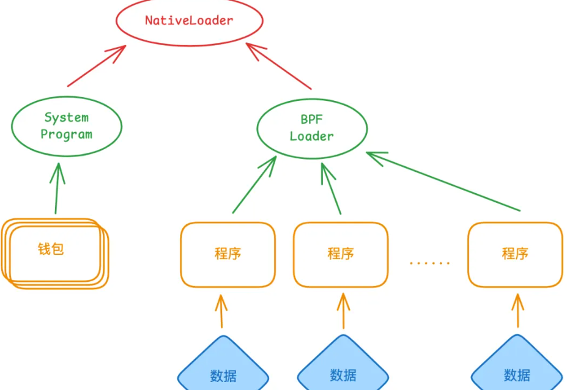

# solana  笔记

### 帐号之间的关系 


### 便于理解 
```bash
solana account 11111111111111111111111111111111
```
```output
jackluo@jackluo-window:/mnt/d/works/learn$ solana account 11111111111111111111111111111111

Public Key: 11111111111111111111111111111111 ###是系统程序的公钥（地址）
Balance: 0.000000001 SOL 
Owner: NativeLoader1111111111111111111111111111111 ### 系统程序的所有者
Executable: true #$#表示这是一个可执行程序
Rent Epoch: 0
Length: 14 (0xe) bytes
0000:   73 79 73 74  65 6d 5f 70  72 6f 67 72  61 6d         system_program ## 数据字段的大小为 14 字节

jackluo@jackluo-window:/mnt/d/works/learn$ 
```
- 你可以将其他账户的公钥（例如你的钱包地址、程序账户或数据账户）替换到命令中，观察输出内容，查看每个账户的Owner 字段。通过这种方式，你可以验证账户之间的所有权关系。